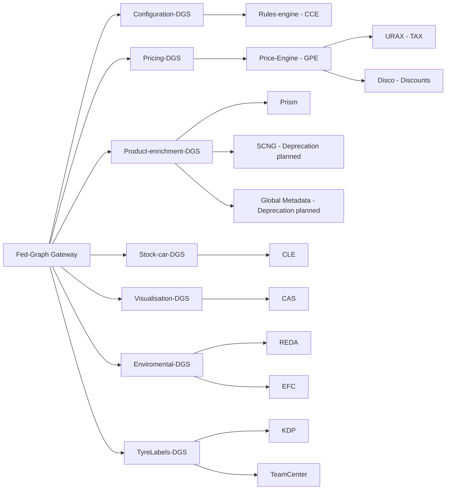

# Federated Graph

The Federated Graph (Fed-Graph) is the main integration towards POP-Cluster (Product, Offer & Price). From this graph a system or user can enrich anything that is related to products that Volvo Cars is selling.

The Fed-Graph is created through dedicated DGS:es (Domain Graph Service) so that each owner of data is responsible for the schema and data from source to client/customer. Our DGS:es right now is:

- Configuration-DGS (POP-Cat - Rules-engine)
- Pricing-DGS (Price-Engine - Price-engine, URAX, Disco)
- Product-enrichment-DGS (Product-enrichment - PRISM, SCNG, Global Metadata)
- Stock-car-DGS (CLE - CLE)
- Visualisation-DGS (CAS - CAS)
- Environmental-DGS (Fed-Graph - REDA, EFC)
- TyreLabels-DGS (Fed-Graph - KDP, TeamCenter)

## Overview of the solution

## How is documentation done

1. Each DGS have there own page in this documentation to describe how to interact with there data.
2. We have the full schema documented
3. The basics of how to use the Fed-Graph